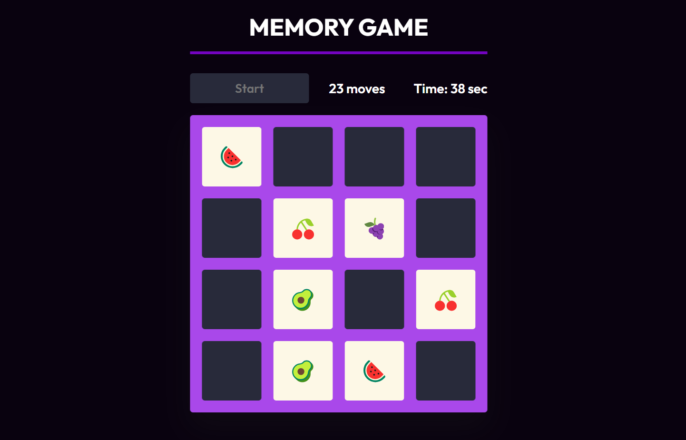

# Memory Game

Welcome to the Memory Game repository! This project is a JavaScript-based web application designed to provide a classic memory game experience. Built with HTML, CSS, and JavaScript, the game features card flip animations, a timer, and a move counter. The modern UI design enhances the overall user experience, making it engaging and visually appealing.

## Preview



## Features

- **Card Flip Animation:** Enjoy smooth and visually appealing card flip animations.
- **Timer:** Challenge yourself by completing the game in the shortest time possible.
- **Move Counter:** Keep track of the number of moves made during the game.
- **Modern UI Design:** Sleek layout and visually appealing design for an enjoyable user interface.

## Getting Started

To run the Memory Game locally, follow these steps:

1. Clone the repository to your local machine:

   ```bash
   git clone https://github.com/Devsethi3/Memory-Game.git
   ```

2. Open the `index.html` file in your preferred web browser.

## How to Play

1. Click on any card to reveal its symbol.
2. Click on a second card to attempt to match it with the first card.
3. If the cards match, they stay open; otherwise, they flip back.
4. Continue revealing and matching cards until all pairs are found.
5. The game tracks the number of moves and elapsed time.
6. Aim for the lowest number of moves and the shortest time to complete the game.

## Customization

Feel free to customize this project to fit your preferences. Update styles, colors, and layout in the HTML and CSS files. You can also modify the number of cards, symbols, or add additional features to enhance the gameplay.

## Contributing

If you'd like to contribute to this project, please follow these steps:

1. Fork the repository.
2. Create a new branch for your feature or improvement.
3. Make your changes and commit them with descriptive messages.
4. Push your changes to your forked repository.
5. Open a pull request to merge your changes into the main branch.

Explore the Memory Game, test your memory skills, and consider contributing to its development. Thank you for checking out the repository!